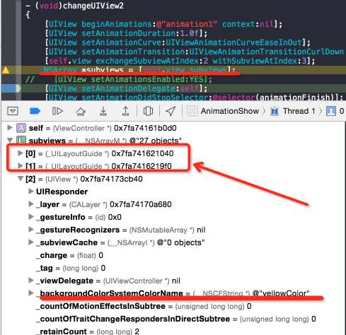

# Animation Show
IOS动画效果和实现
  
* 动画效果提供了状态或页面转换时流畅的用户体验，在iOS系统中，咱们不需要自己编写绘制动画的代码，Core Animation提供了丰富的api来实现你需要的动画效果。
    UIKit只用UIView来展示动画,动画支持UIView下面的这些属性改变：  
frame  
bounds  
center  
transform  
alpha   
backgroundColor   
contentStretch

## Where I learn? You can do it absolutely.
learn from [iOS动画效果和实现](http://blog.csdn.net/totogo2010/article/details/8501812)[容芳志专栏], add button layer, implement all the tutorial to view,  
remedy view queue in ios 8.4. 下面只说明ios8.4有误的地方，
及贡献实效效果。

## The result pictures show.

###1. commitAnimations方式使用UIView动画  


**添加属性 --全文有用到的属性**

```
@property (strong, nonatomic) UIView *moveView;

@property (strong, nonatomic) NSArray *transitionTypeArray;
@property (strong, nonatomic) NSArray *transitionSubTypeArray;
@property (strong, nonatomic) NSArray *transitionTypePrivateArray;
```


```
- (void)viewDidLoad {
    [super viewDidLoad];

    /** 设置5种 transition begin **/
    
    NSArray *nameArray = @[@"None", @"Right", @"Left", @"Up", @"Down"];
    NSArray *trasitionArray = @[@(UIViewAnimationTransitionNone), @(UIViewAnimationTransitionFlipFromRight), @(UIViewAnimationTransitionFlipFromLeft), @(UIViewAnimationTransitionCurlUp), @(UIViewAnimationTransitionCurlDown)];
    
    for (int i = 0; i < 5; i++) {
        UIButton *button = [UIButton buttonWithType:UIButtonTypeSystem];
        
        [button setTitle:nameArray[i] forState:UIControlStateNormal];
        button.frame = CGRectMake(20, (30 + 50 * i), 60, 40);
        button.tag = [trasitionArray[i] integerValue];
        // 按钮边框宽度
        button.layer.borderWidth = 1.5;
        // 设置圆角
        button.layer.cornerRadius = 4.5;
        // 设置颜色空间为rgb，用于生成ColorRef
        CGColorSpaceRef colorSpace = CGColorSpaceCreateDeviceRGB();
        // 新建一个红色的ColorRef，用于设置边框（四个数字分别是 r, g, b, alpha）
        CGColorRef borderColorRef = CGColorCreate(colorSpace, (CGFloat[]){1, 0, 0, 1});
        // 设置边框颜色
        button.layer.borderColor = borderColorRef;
        button.backgroundColor = [UIColor purpleColor];
        
        [button addTarget:self action:@selector(changeUIView:) forControlEvents:UIControlEventTouchUpInside];
        
        [self.view addSubview:button];
        button = nil;
    }
    
    
    /** 设置5种 transition end **/
   
}

- (void)changeUIView:(UIButton *)btn
{
    [UIView beginAnimations:@"animation" context:nil];
    [UIView setAnimationDuration:1.0f];
    [UIView setAnimationCurve:UIViewAnimationCurveEaseInOut];
    [UIView setAnimationTransition:btn.tag forView:self.view cache:YES];  
    [UIView commitAnimations];
}
```

```
动画的常量有以下四种  
* UIViewAnimationTransitionNone,  
* UIViewAnimationTransitionFlipFromLeft,  
* UIViewAnimationTransitionFlipFromRight,  
* UIViewAnimationTransitionCurlUp,  
* UIViewAnimationTransitionCurlDown, 
```


###1.2 交换本视图控制器中2个view位置
[self.view exchangeSubviewAtIndex:2 withSubviewAtIndex:3];  
**注意:在autolayout模式下，subview0，subview1用作autolyout**



先添加两个view ,一个redview  一个yellowview

```
- (void)viewDidLoad {
    [super viewDidLoad];
    // Do any additional setup after loading the view, typically from a nib.
    
    UIView *redView = [[UIView alloc] initWithFrame:[[UIScreen mainScreen] bounds]];
    redView.backgroundColor = [UIColor redColor];
    [self.view addSubview:redView];
    
    UIView *yellowView = [[UIView alloc] initWithFrame:[[UIScreen mainScreen] bounds]];
    yellowView.backgroundColor = [UIColor yellowColor];
    [self.view addSubview:yellowView];
    
    UIButton *button1 = [UIButton buttonWithType:UIButtonTypeSystem];
    [button1 setTitle:@"Change" forState:UIControlStateNormal];
    button1.frame = CGRectMake(90, 30, 70, 40);
//    button1.tag = 1;
    button1.layer.borderWidth = 1.5;
    button1.layer.cornerRadius = 4.5;
    [button1 addTarget:self action:@selector(changeUIView1) forControlEvents:UIControlEventTouchUpInside];
    [self.view addSubview:button1];
    button1 = nil;
    
    UIButton *button2 = [UIButton buttonWithType:UIButtonTypeSystem];
    [button2 setTitle:@"Change1" forState:UIControlStateNormal];
    button2.frame = CGRectMake(90, 80, 70, 40);
    button2.layer.borderWidth = 1.5;
    button2.layer.cornerRadius = 4.5;
    [button2 addTarget:self action:@selector(changeUIView2) forControlEvents:UIControlEventTouchUpInside];
    [self.view addSubview:button2];

}


- (void)changeUIView2
{
    [UIView beginAnimations:@"animation1" context:nil];
    [UIView setAnimationDuration:1.0f];
    [UIView setAnimationCurve:UIViewAnimationCurveEaseInOut];
    [UIView setAnimationTransition:UIViewAnimationTransitionCurlDown forView:self.view cache:YES];
    [self.view exchangeSubviewAtIndex:2 withSubviewAtIndex:3];
    NSArray *subviews = [self.view subviews];
//    [UIView setAnimationsEnabled:YES];
    [UIView setAnimationDelegate:self];
    [UIView setAnimationDidStopSelector:@selector(animationFinish)];
    [UIView commitAnimations];
}

- (void)changeUIView1
{
    [UIView beginAnimations:@"animation1" context:nil];
    [UIView setAnimationDuration:1.0f];
    [UIView setAnimationCurve:UIViewAnimationCurveEaseInOut];
    [UIView setAnimationTransition:UIViewAnimationTransitionCurlUp forView:self.view cache:YES];
    [self.view exchangeSubviewAtIndex:2 withSubviewAtIndex:3];
    NSArray *subviews = [self.view subviews];
    [UIView commitAnimations];
}

```

###1.3 、   [UIView setAnimationDidStopSelector:@selector(animationFinish:)];
在commitAnimations消息之前，可以设置动画完成后的回调，设置方法是：  
    [UIView setAnimationDidStopSelector:@selector(animationFinish:)];

```
一定需要在commitAnimations 之前加上delegate(例子在函数- (void)changeUIView2):  
[UIView setAnimationDelegate:self];  

- (void)animationFinish
{
    UIAlertView *alertView = [[UIAlertView alloc] initWithTitle:@"animationFinish" message:@"animationMessage" delegate:nil cancelButtonTitle:@"OK" otherButtonTitles: nil];
    [alertView show];
}
```


###2.1、使用：CATransition
transition.type 的类型可以有  
淡化、推挤、揭开、覆盖 四种 
NSString * const kCATransitionFade;  
NSString * const kCATransitionMoveIn;  
NSString * const kCATransitionPush;  
NSString * const kCATransitionReveal;  

transition.subtype 也有四种  
NSString * const kCATransitionFromRight;  
NSString * const kCATransitionFromLeft;  
NSString * const kCATransitionFromTop;  
NSString * const kCATransitionFromBottom;  

```
- (void)viewDidLoad {
 /** 设置4种 CATransition begin **/
   
    NSArray *transitionNameArray = @[@"Fade-Right", @"MoveIn-Left", @"Push-Top", @"Reveal-Bottom"];
    self.transitionTypeArray = @[kCATransitionFade, kCATransitionMoveIn, kCATransitionPush, kCATransitionReveal];
    self.transitionSubTypeArray = @[kCATransitionFromRight, kCATransitionFromLeft, kCATransitionFromTop, kCATransitionFromBottom];
    for (int i = 0; i < 4; i++) {
        UIButton *button = [UIButton buttonWithType:UIButtonTypeSystem];
        
        [button setTitle:transitionNameArray[i] forState:UIControlStateNormal];
        button.frame = CGRectMake(165, (30 + 50 * i), 100, 40);
        button.tag = i;
        // 按钮边框宽度
        button.layer.borderWidth = 1.5;
        // 设置圆角
        button.layer.cornerRadius = 4.5;
        // 设置颜色空间为rgb，用于生成ColorRef
        CGColorSpaceRef colorSpace = CGColorSpaceCreateDeviceRGB();
        // 新建一个红色的ColorRef，用于设置边框（四个数字分别是 r, g, b, alpha）
        CGColorRef borderColorRef = CGColorCreate(colorSpace, (CGFloat[]){1, 1, 1, 1});
        // 设置边框颜色
        button.layer.borderColor = borderColorRef;
        button.backgroundColor = [UIColor blueColor];
        
        [button addTarget:self action:@selector(changeTransition:) forControlEvents:UIControlEventTouchUpInside];
        
        [self.view addSubview:button];
        button = nil;
    }
}

- (void)changeTransition:(UIButton *)btn
{
    CATransition *transition = [CATransition animation];
    transition.duration = 2.0f;
    transition.type = self.transitionTypeArray[btn.tag];
    transition.subtype = self.transitionSubTypeArray[btn.tag];
    NSLog(@"transition.type:%@, transition.subtype:%@", transition.type, transition.subtype);
    [self.view exchangeSubviewAtIndex:3 withSubviewAtIndex:2];
    [self.view.layer addAnimation:transition forKey:@"animation"];
}
```


###2.2 私有的类型的动画类型：
**立方体、吸收、翻转、波纹、翻页、反翻页、镜头开、镜头关**  
animation.type = @"cube"    
animation.type = @"suckEffect";    
animation.type = @"oglFlip";//不管subType is "fromLeft" or "fromRight",official只有一种效果  
animation.type = @"rippleEffect";   
animation.type = @"pageCurl";   
animation.type = @"pageUnCurl"  
animation.type = @"cameraIrisHollowOpen ";  
animation.type = @"cameraIrisHollowClose "; 

```
- (void)viewDidLoad {
 /** 设置7种 CATransition private type begin **/
    self.transitionTypePrivateArray = @[@"cube", @"suckEffect", @"oglFlip", @"rippleEffect", @"pageCurl", @"pageUnCurl", @"cameraIrisHollowOpen", @"cameraIrisHollowClose"];
    for (int i = 0; i < 7; i++) {
        UIButton *button = [UIButton buttonWithType:UIButtonTypeSystem];
        
        [button setTitle:self.transitionTypePrivateArray[i] forState:UIControlStateNormal];
        button.frame = CGRectMake(275, (30 + 50 * i), 90, 40);
        button.tag = i;
        // 按钮边框宽度
        button.layer.borderWidth = 1.5;
        // 设置圆角
        button.layer.cornerRadius = 4.5;
        // 设置颜色空间为rgb，用于生成ColorRef
        CGColorSpaceRef colorSpace = CGColorSpaceCreateDeviceRGB();
        // 新建一个红色的ColorRef，用于设置边框（四个数字分别是 r, g, b, alpha）
        CGColorRef borderColorRef = CGColorCreate(colorSpace, (CGFloat[]){0, 1, 1, 1});
        // 设置边框颜色
        button.layer.borderColor = borderColorRef;
        button.backgroundColor = [UIColor greenColor];
        
        [button addTarget:self action:@selector(changeTransitionRandom:) forControlEvents:UIControlEventTouchUpInside];
        
        [self.view addSubview:button];
        button = nil;
    }
    
    /** 设置7种 CATransition private type end **/
    
    
}


- (void)changeTransitionRandom:(UIButton *)btn
{
    CATransition *transition = [CATransition animation];
    transition.duration = 2.0f;
    
    transition.type = self.transitionTypePrivateArray[btn.tag];
    transition.subtype = self.transitionSubTypeArray[(arc4random() % 4)];
    NSLog(@"transition.type:%@, transition.subtype:%@", transition.type, transition.subtype);
    [self.view exchangeSubviewAtIndex:3 withSubviewAtIndex:2];
    [self.view.layer addAnimation:transition forKey:@"animation"];
}


``` 


###2.3 CATransition的 startProgress  endProgress属性
这两个属性是float类型的。  
可以控制动画进行的过程，可以让动画停留在某个动画点上，值在0.0到1.0之间。endProgress要大于等于startProgress。  
比如上面的立方体转到，可以设置endProgress= 0.5，让动画停留在转动一般的位置。  
上面这些私有的动画效果，在实际应用中要谨慎使用。因为在app store审核时可能会以为这些动画效果而拒绝通过。

```
- (void)changeTransitionRandom:(UIButton *)btn
{
    CATransition *transition = [CATransition animation];
    transition.duration = 2.0f;
    
    transition.type = self.transitionTypePrivateArray[btn.tag];
    transition.subtype = self.transitionSubTypeArray[(arc4random() % 4)];
    transition.endProgress= (arc4random() % 10) / 10.0;
    NSLog(@"transition.type:%@, transition.subtype:%@", transition.type, transition.subtype);
    [self.view exchangeSubviewAtIndex:3 withSubviewAtIndex:2];
    [self.view.layer addAnimation:transition forKey:@"animation"];
}
```

###3、UIView的 + (void)animateWithDuration:(NSTimeInterval)duration animations:(void (^)(void))animations completion:(void (^)(BOOL finished))completion方法。  
这个方法是在iOS4.0之后才支持的。
比 1 里的UIView的方法简洁方便使用。
DidView里添加moveView。然后用UIView animateWithDuration动画移动，移动动画完毕后添加一个Label。

```
- (void)viewDidLoad {
    self.moveView = [[UIView alloc] initWithFrame:CGRectMake(10, 270, 50, 40)];
    self.moveView.backgroundColor = [UIColor orangeColor];
    [self.view addSubview:self.moveView]; 

	 UIButton *button4 = [UIButton buttonWithType:UIButtonTypeSystem];
    [button4 setTitle:@"Duration" forState:UIControlStateNormal];
    button4.frame = CGRectMake(90, 180, 70, 40);
    button4.layer.borderWidth = 1.5;
    button4.layer.cornerRadius = 4.5;
    [button4 addTarget:self action:@selector(changeUIView4) forControlEvents:UIControlEventTouchUpInside];
    [self.view addSubview:button4];
    
}

- (void)changeUIView4
{
    [UIView animateWithDuration:3 animations:^{
        self.moveView.frame = CGRectMake(10, 320, 200, 40);
    }completion:^(BOOL finished) {
        UILabel *label = [[UILabel alloc] initWithFrame:CGRectMake(220, 320, 40, 40)];
        label.backgroundColor = [UIColor cyanColor];
        [self.view addSubview:label];
    }];
}
```
###3.2、 animateWithDuration的嵌套使用
**这个嵌套的效果是先把view变成透明，在从透明变成不透明，重复2.5次透明到不透明的效果。**  

```
- (void)viewDidLoad {
	 UIButton *button5 = [UIButton buttonWithType:UIButtonTypeSystem];
    [button5 setTitle:@"Block" forState:UIControlStateNormal];
    button5.frame = CGRectMake(90, 230, 70, 40);
    button5.layer.borderWidth = 1.5;
    button5.layer.cornerRadius = 4.5;
    [button5 addTarget:self action:@selector(changeUIView5) forControlEvents:UIControlEventTouchUpInside];
    [self.view addSubview:button5];
}


- (void)changeUIView5
{
    [UIView animateWithDuration:2 delay:0 options:UIViewAnimationOptionCurveEaseOut animations:^{
        self.moveView.alpha = 0.0;
    } completion:^(BOOL finished) {
        [UIView animateWithDuration:1 delay:1.0 options:UIViewAnimationOptionAutoreverse | UIViewAnimationOptionRepeat animations:^{
            [UIView setAnimationRepeatCount:2.5];
            self.moveView.alpha = 1.0;
        } completion:^(BOOL finished) {
            
        }];
    }];
}
```


###其他引用资源
[iOS 7 app store 带边框的按钮是怎么实现的？](http://www.zhihu.com/question/21710875)[王炫殊]

```
// 按钮边框宽度
yourButton.layer.borderWidth = 1.5;
// 设置圆角
yourButton.layer.cornerRadius = 4.5;
```
[OskarGroth/UIButton-Bootstrap](https://github.com/OskarGroth/UIButton-Bootstrap)[ Oskar Groth]


[【IOS开发】@selector 调用方法，传递多参数。。](http://blog.sina.com.cn/s/blog_721cd3390101vnyq.html)[调调小黑的博客]

```
1. 首先，@selector 里面的方法不能传参数。。不要相信网上的。。都是复制粘贴的。
2. 分三步走：1.设置tag。2.设置btn的调用方法。3.使用参数
3. 看示例代码把。。
   UIButton * markButton=[[UIButton alloc] initWithFrame:CGRectMake(280, 0, 30, 30)];
    markButton.tag=@"参数值"; //这里是你要传递的参数值
    [markButton addTarget:self action:@selector(addMark:)  forControlEvents:UIControlEventTouchUpInside];

addMark函数做处理。
-(BOOL) addMark:(UIButton *)btn{
    NSLog(@"%@",btn.tag];
｝
```


 
